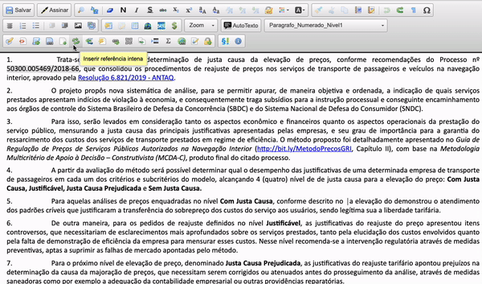

#  |  SEI Pro 

##  Adicionar referências internas

Em documentos com **parágrafos numerados**, é comum escrever "conforme o item 4.2" ou "nos termos do parágrafo 15". A **referência interna** cria essa remissão **com link** para o parágrafo citado — e, se a numeração mudar, basta atualizar para os números se corrigirem.

> 

### Como usar

1. Formate o documento com os **estilos de parágrafo numerado** do SEI;
2. Clique no ponto do texto onde a remissão deve entrar;
3. Clique no botão **Inserir referência interna**;
4. Em **Parágrafo numerado**, escolha o parágrafo que será citado;
5. Em **Prefixo**, informe o texto que deve aparecer antes do número ou marque **Não utilizar prefixo**;
6. Clique em **Inserir**.

### Quando a numeração muda

Inseriu ou apagou parágrafos? Abra a mesma janela e clique em **Atualizar referências**: todas as remissões do documento passam a mostrar a numeração nova.

### Como ativar

O botão aparece sempre no editor do SEI quando o SEI Pro está instalado.

### Bom saber

* Funciona como uma nota de rodapé ao contrário: em vez de ir para o fim do documento, o link leva ao parágrafo citado.
* Para normas com artigos, incisos e alíneas, a [Legística](../pages/LEGISTICA.md) tem referências cruzadas próprias, com o sinal `#`.

## Próximo item

> [Inserir sumário](../pages/SUMARIO.md)
