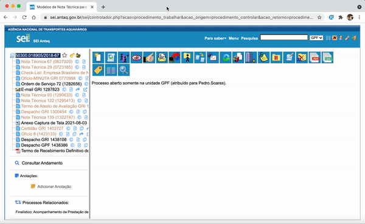

#  |  SEI Pro 

##  Redimensionar automaticamente a árvore do processo pela sua largura total

A coluna da árvore do processo tem largura fixa, e nomes de documentos longos ficam cortados. Com esta função, **a coluna se ajusta sozinha para caber o nome mais comprido** — sem cortes e sem barra de rolagem horizontal.

> 

### Como usar

Com a função ligada, o ajuste acontece ao abrir o processo.

Com o [Estilo Avançado](../pages/ESTILOAVANCADO.md) ativo, você também pode:

* **Arrastar a divisória** entre a árvore e o documento para escolher a largura à mão;
* **Dar um duplo clique na divisória** para reajustar a largura ao nome mais comprido, na hora.

### Como ativar

A função vem **desligada** de fábrica. Para ligar, abra as [Configurações do SEI Pro](../pages/DESATIVARFUNCOES.md), aba **Geral**, seção **Árvore e Visualização de Documentos**, e marque **Redimensionar automaticamente a árvore do processo pela sua largura total**. Clique em **Salvar** e recarregue o processo.

### Bom saber

* Em telas pequenas, uma árvore larga deixa menos espaço para o documento. Se isso incomodar, prefira [Dividir as informações do documento em duas linhas](../pages/DIVIDIRLINHASARVORE.md), que resolve os nomes longos sem alargar a coluna.
* A largura escolhida ao arrastar a divisória fica gravada para os próximos processos, neste navegador.

## Próximo item

> [Ações em Lote: assinar, dar ciência, excluir e alterar sigilo de vários documentos](../pages/ACOESEMLOTE.md)
