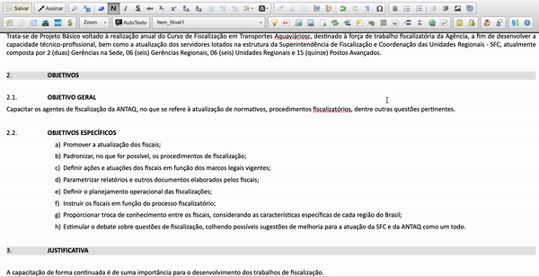
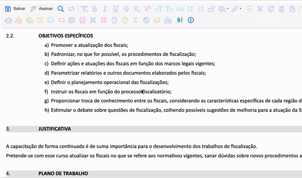
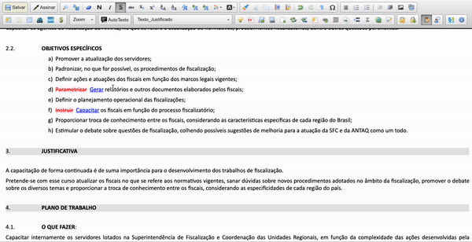

#  |  SEI Pro 

##  Revisão de texto no editor de documentos

Essa funcionalidade adiciona ao editor de documentos do SEI o controle de revisão de textos.

> 

Quanto ativado, os textos inseridos e excluído no documento são adicionar com estilo específico 
(inserido: cor de fonte azul, texto sublinhado)
(removido: cor de fonte vermelha, texto taxado)

> 

Para facilitar a compreensão dos trechos inseridos ou removidos, é possível adicionar comentários às alterações promovidas.

> 

Ainda, a partir do ícone do **Gerenciador de revisão de texto** será possível analisar todas as alterações promovidas no texto,
com a possibilidade de aprová-las ou rejeitá-las (individualmente ou em lote)

## Próximo item

> [.](../pages/.md)

