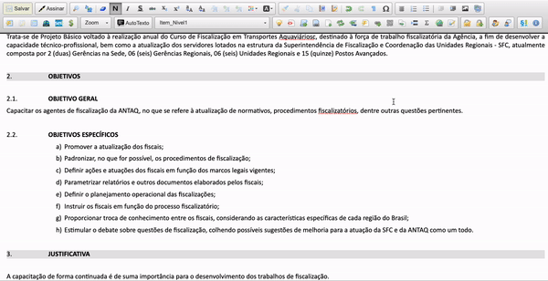
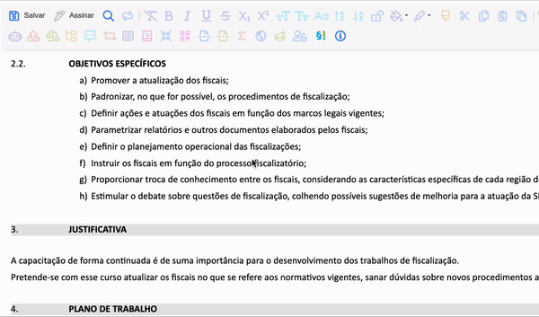
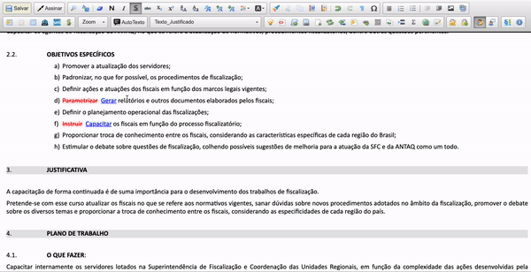

#  |  SEI Pro 

##  Revisão de texto (controle de alterações)

O **controle de alterações** do Word, dentro do SEI: com a revisão ligada, tudo o que é **incluído** e **excluído** no documento fica marcado, com o nome de quem alterou e quando. Depois, o autor **aceita ou rejeita** cada alteração — uma a uma ou todas de uma vez.

> 

### Como revisar

1. No editor, clique em **Ativar revisão de texto**;
2. Edite normalmente. As alterações aparecem marcadas:
   * **texto incluído**: em **azul, sublinhado**;
   * **texto excluído**: em **vermelho, riscado** (continua visível até ser aceito);
3. Salve o documento.

> 

### Comentar uma alteração

Passe o mouse sobre uma marca de revisão para ver quem alterou e quando. No mesmo balão é possível **escrever um comentário** explicando a mudança.

> 

### Aceitar ou rejeitar

* **Uma alteração:** passe o mouse sobre a marca e clique em **Aceitar** ou **Rejeitar**;
* **Todas:** clique em **Gerenciar revisões de texto**. A janela lista todas as marcas, com autor, data e comentário; use **Aceitar Todas** ou **Rejeitar todas**, ou decida item a item.

Ao aceitar, a inclusão vira texto normal e a exclusão é apagada. Ao rejeitar, acontece o contrário.

### Como ativar

A função vem **ligada** de fábrica. Ela fica nas [Configurações do SEI Pro](../pages/DESATIVARFUNCOES.md), aba **Geral**, seção **Editor de Texto**, opção **Revisão de texto no editor de documentos**.

### Bom saber

* As marcas ficam **gravadas no documento**. Quem não usa o SEI Pro vê o texto colorido, mas não consegue aceitar ou rejeitar.
* **Resolva todas as revisões antes de assinar**: marcas pendentes aparecem na versão assinada.

## Próximo item

> [Marcas de sigilo e tarjas pretas de confidencialidade (LGPD)](../pages/SIGILODOC.md)
