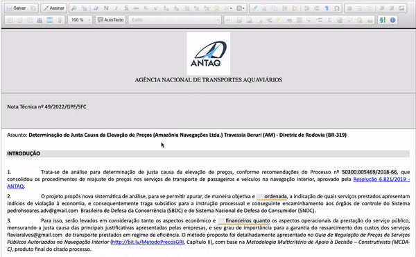

#  |  SEI Pro 

##  Salvar documentos automaticamente

Essa ferramenta adiciona ao editor de texto SEI a possibilidade de salvar automaticamente do documento após um período pré-determinado.

>  

Essa funcionalidade não vem ativada por padrão no **SEI Pro**, sendo necessário ativá-la na barra de ferramentas do **Editor do SEI**.

Definir o intervalo de salvamento automático para **0** irá desativar a funcionalidade. 

## Próximo item

> [Inserir ...](../pages/PAGE.md)
