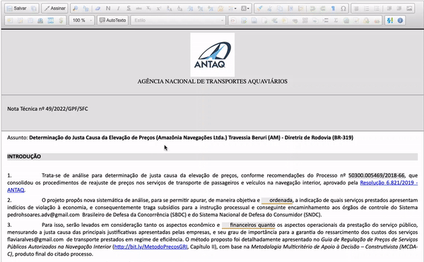

#  |  SEI Pro 

##  Salvar documentos automaticamente

> **Função temporariamente indisponível.** O salvamento automático foi retirado do editor na versão 1.0 do SEI Pro e ainda não voltou. Por isso a opção **Intervalo em minutos para o salvamento automático** fica oculta nas configurações do SEI Pro.

A proposta da função é salvar o documento em edição a cada intervalo de tempo definido, evitando perder o texto se o navegador fechar ou a sessão do SEI expirar.

> 

### Enquanto isso

* Salve com frequência pelo botão **Salvar** do editor;
* Antes de sair para almoço ou reunião, salve o documento: a sessão do SEI expira e o texto não salvo se perde.

## Próximo item

> [Configurações do SEI Pro: ligar e desligar funções](../pages/DESATIVARFUNCOES.md)
