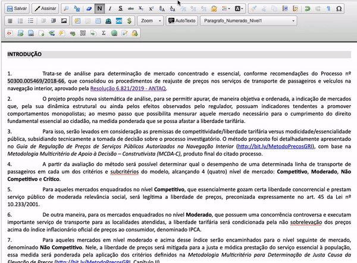
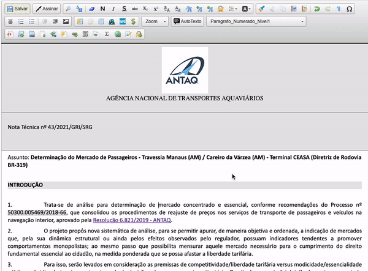

#  |  SEI Pro 

##  Adicionar marca de sigilo e tarjas pretas de confidencialidade

Essa funcionalidade adiciona ao editor de texto do SEI a possibilidade de adicionar marca de sigilo e tarjas pretas de confidencialidade ao documento.

>   

### Marcas de sigilo e tarjas pretas

A extensão SEI Pro não controla o acesso ou a visualização de partes do texto que é mostrado no SEI.
Para conseguir manter a confidencialidade de textos censurados, a alternativa mais segura é substituir o texto sigiloso 
por marcas indecifráveis (tarjas de confidencialidade)

o processo de aplicação de tarjas de confidencialidade perde totalmente o texto tarjado.
Por isso, é recomendado que o usuário crie 2 (duas) versões do documento:

* A 1ª versão com nível de acesso restrito (ou sigiloso), mas com as informações íntegras e marcadas com o símbolo do 🔒 (cadeado).

É possível adicionar marcas de sigilo manualmente ou localizando um texto por todo o documento.
Caso deseje, é possível ainda remover todas as marcas de sigilo na aba **"Remover marcas"**

>   

* A 2ª versão com nível de acesso público, com as informações já marcadas como sigilosas convertidas em tarjas pretas de confidencialidade.

>   
 
As informações tarjadas são perdidas após salvar e abandonar o editor de documentos do SEI. 
Enquanto aberto do editor, o botão **"Desfazer"** (Control+Z) poderá reverter a aplicação de tarjas pretas.

## Próximo item

> [Desativar funções da extensão](../pages/DESATIVARFUNCOES.md)
