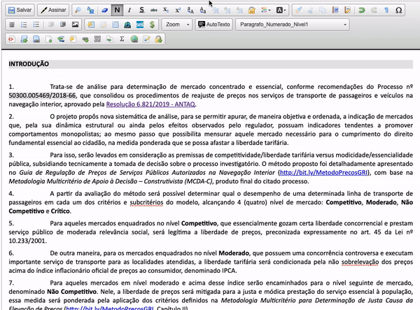
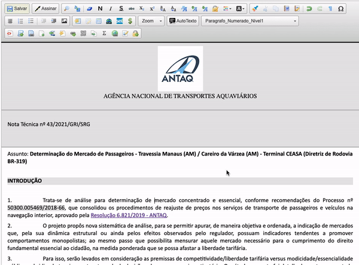

#  |  SEI Pro 

##  Marcas de sigilo e tarjas pretas de confidencialidade

Precisa publicar um documento que tem **trechos protegidos** — CPF, endereço, dados de saúde, segredo comercial? Com esta função você **marca os trechos sigilosos** e, quando for gerar a versão pública, **transforma as marcas em tarjas pretas**, que **substituem o texto de verdade**.

> 

### Por que tarjar e não só esconder

O SEI Pro não controla quem vê cada parte do texto. A única forma segura de publicar um documento com trechos sigilosos é **apagar esses trechos** da versão pública. A tarja faz exatamente isso: o texto marcado é trocado por blocos pretos e **deixa de existir** no documento.

Por isso, o caminho recomendado usa **duas versões** do documento:

1. **A versão íntegra**, com nível de acesso **restrito** (ou sigiloso), com as informações completas e os trechos sigilosos **marcados** com o cadeado 🔒;
2. **A versão pública**, com as marcas **convertidas em tarjas**.

Para gerar a versão pública com fé pública, veja [Certidão de documento oficial com sigilo](../pages/CERTIDAOSIGILO.md).

### Marcar trechos

* **Um trecho:** selecione o texto e clique em **Adicionar / Remover marca de sigilo no texto**. Clique de novo para desmarcar;
* **Todas as ocorrências de um texto:** em **Gerenciar marcas de sigilo do documento**, use **Localizar texto e adicionar marca** — por exemplo, o nome de uma pessoa, em todo o documento;
* **Dados pessoais:** na mesma janela, **Localizar dados pessoais** marca de uma vez os **e-mails e CPFs** encontrados no texto.

> 

Na aba **Remover marcas** é possível retirar marcas individualmente ou **todas de uma vez**.

### Aplicar as tarjas

1. Abra **Gerenciar marcas de sigilo do documento**;
2. Clique em **Aplicar tarja de sigilo**;
3. Todas as marcas viram tarjas pretas.

> 

> **Atenção:** enquanto o editor estiver aberto, **Desfazer** (`Ctrl + Z`) ainda reverte as tarjas. **Depois de salvar e sair do editor, as marcas tarjadas não podem mais ser revertidas** — o texto original se perdeu nessa versão.

### Como ativar

Os botões aparecem sempre no editor do SEI quando o SEI Pro está instalado.

### Bom saber

* A busca automática encontra **e-mails e CPFs**. Nomes, endereços, RG e outros dados precisam ser marcados à mão ou pela busca de texto. **Sempre revise o documento inteiro** antes de publicar.
* Para tarjar **PDFs** e outros arquivos anexados, use [Tarjar PDF, nas Ferramentas de PDF](../pages/FERRAMENTASPDF.md).
* A janela de gerenciamento tem um **Guia rápido** com o passo a passo.

## Próximo item

> [Ditado no editor de documentos](../pages/DITADO.md)
