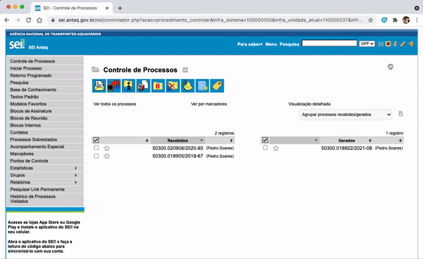

#  |  ANTAQ Pro 

##    Utilizar caixas de seleção inteligentes

Essa funcionalidade muda a opção de utilizar caixas de seleção inteligentes, ao digitar a palavra ele filtra a seleção desejada.

>   

## Próximo item

> [Desativar funções da extensão](../pages/DESATIVARFUNCOES.md)
