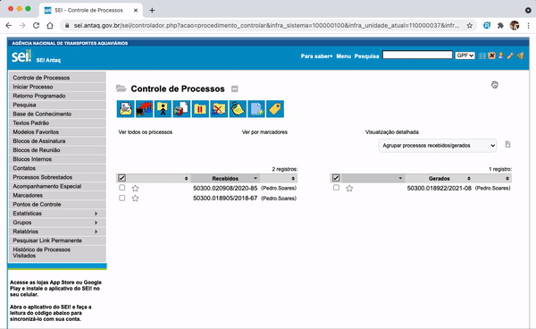

#  |  SEI Pro 

##  Utilizar caixas de seleção inteligentes

Listas longas do SEI — tipos de documento, tipos de processo, unidades, hipóteses legais — obrigam a rolar e procurar item por item. Com esta função, **as caixas de seleção ganham um campo de busca**: comece a digitar e a lista mostra só o que interessa.

> 

### Como usar

1. Clique numa caixa de seleção do SEI;
2. **Digite parte do nome** — não precisa ser o começo, e **acentos são ignorados** (`oficio` encontra *Ofício*);
3. Clique no item ou use `↑` `↓` e `Enter`.

Se nada for encontrado, aparece *Nenhum resultado encontrado*.

### Trocar de unidade pelo cabeçalho

Uma segunda opção troca o link da **unidade atual**, no cabeçalho do SEI, por uma **caixa com todas as unidades** a que você tem acesso — no formato *SIGLA (ÓRGÃO)*. Basta escolher a unidade para mudar, sem passar pela tela de seleção de unidades.

### Como ativar

As duas opções vêm **desligadas** de fábrica. Nas [Configurações do SEI Pro](../pages/DESATIVARFUNCOES.md), aba **Geral**, seção **Controle de Processos**:

| Opção | Efeito |
| ----- | ------ |
| **Utilizar caixas de seleção inteligentes** | Caixas com busca nos formulários, filtros e janelas do SEI Pro |
| **Trocar unidades utilizando caixas de seleção (SEI ≥ 4.0)** | Caixa de unidades no cabeçalho do SEI 4 e 5 |

Clique em **Salvar** e recarregue o SEI.

### Bom saber

* A lista de unidades é carregada uma vez por sessão. Se você ganhou acesso a uma unidade nova e ela não aparece, feche a aba do SEI e entre novamente.
* A troca de unidade pelo cabeçalho depende das consultas adicionais — veja [Desativar consultas adicionais](../pages/DESATIVACONSULTAS.md).

## Próximo item

> [Título da aba com o número do processo](../pages/TITULOPAGINA.md)
