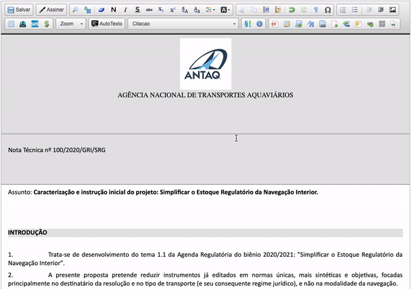

#  |  SEI Pro 

##  Inserir sumário

Documentos longos — relatórios, pareceres, termos de referência — ficam muito mais fáceis de ler com um **sumário**. O SEI Pro monta o sumário **a partir dos títulos do documento**, com **links** que levam direto a cada parte.

> 

### Como usar

1. Formate os títulos do documento com **estilos** do SEI (por exemplo, *Item Nível 1* para os títulos principais e *Item Nível 2* para os subtítulos);
2. Clique no ponto onde o sumário deve entrar;
3. Clique no botão **Inserir sumário**;
4. Informe o **Estilo do Título 1** (obrigatório) e, se houver, o **Estilo do Título 2** e o **Estilo do Título 3**;
5. Clique em **Inserir**.

O sumário entra com o título **SUMÁRIO** e a lista dos títulos, com recuo conforme o nível.

> 

### Como ativar

O botão aparece sempre no editor do SEI quando o SEI Pro está instalado.

### Bom saber

* Informe **apenas os estilos usados nos títulos**. Se o estilo escolhido também for usado em parágrafos comuns, eles entram no sumário.
* O sumário **não se atualiza sozinho**. Se você acrescentar ou renomear títulos, apague o sumário e insira de novo.
* Os links funcionam na visualização do documento no SEI.

## Próximo item

> [Inserir equações (fórmulas matemáticas)](../pages/EQUACOES.md)
