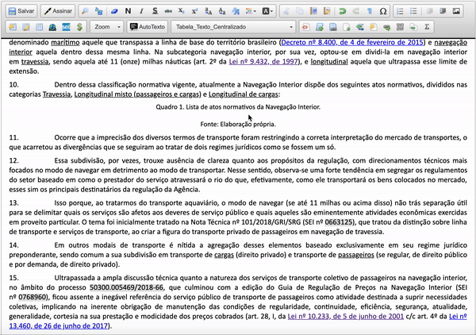

#  |  SEI Pro 

##  Tabela rápida

Crie uma tabela no editor do SEI **escolhendo o tamanho com o mouse**, numa grade — sem abrir a janela de propriedades de tabela.

> 

### Como usar

1. Clique no lugar do documento onde a tabela deve entrar;
2. Na barra do editor, clique em **Tabela Rápida** (raio);
3. Passe o mouse sobre a grade: as células destacadas mostram quantas **linhas × colunas** a tabela terá;
4. Clique para inserir.

### Como ativar

O botão aparece sempre no editor do SEI quando o SEI Pro está instalado.

### Bom saber

* A grade vai até **50 linhas × 50 colunas**.
* A tabela entra com as bordas e os estilos de parágrafo de tabela do SEI. Para colorir e dar outro visual, use [Adicionar estilo à tabela](../pages/ESTILOTABELA.md).

## Próximo item

> [Alinhar o texto à esquerda, ao centro, à direita ou justificado](../pages/ALINHARTEXTO.md)
