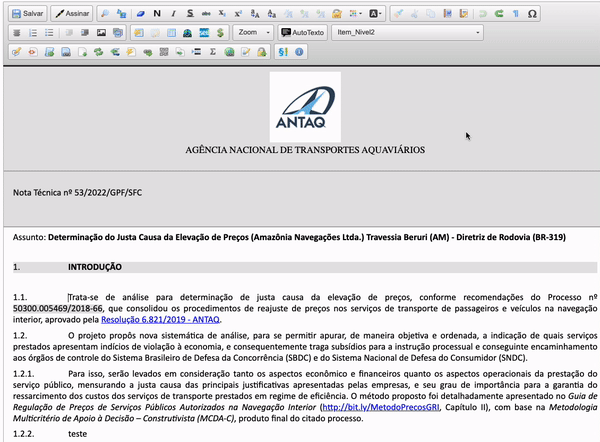
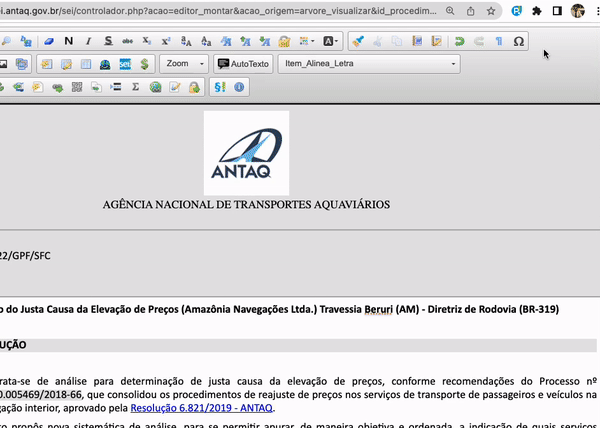

#  |  SEI Pro 

##  Adicionar teclas de atalhos no editor de documentos

Essa funcionalidade permite a utilização de combinações do teclado para acionar estilos de parágrafo no editor de documentos do SEI.

>  

Ainda, é possível escolher as combinações de teclas que deseja utilizar: `Control + Alt + Shift`, `Control + Shift`, `Control + Alt` ou `Alt + Shift`

>  
> 
## Próximo item

> [Adicionar referências internas](../pages/REFERENCIAINTERNA.md)
