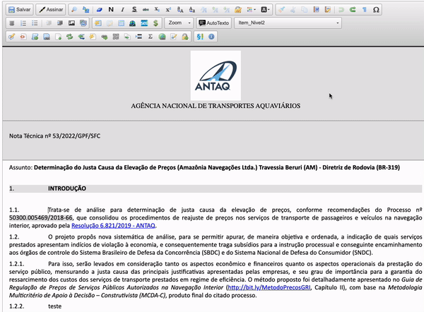
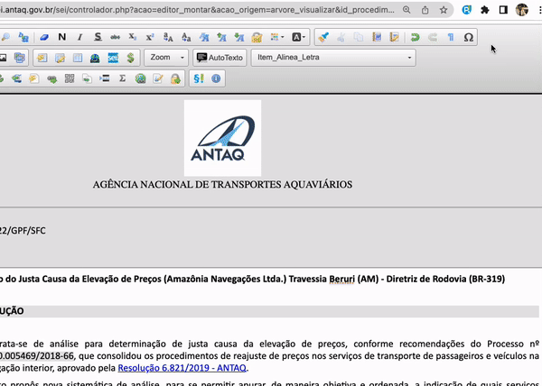

#  |  SEI Pro 

##  Teclas de atalho para os estilos do editor

Quem escreve muito no SEI troca de estilo o tempo todo: texto justificado, parágrafo numerado, citação, item... Com esta função, **cada estilo de parágrafo ganha uma combinação de teclas**, e você formata sem tirar as mãos do teclado.

> 

### Como usar

1. No editor, abra a caixa **Estilo** da barra de ferramentas;
2. Ao lado de cada estilo aparece a sua combinação — por exemplo, `CTRL + ALT + SHIFT + 1`;
3. Clique num parágrafo do texto e pressione a combinação: o parágrafo recebe o estilo.

Os atalhos seguem a ordem da lista de estilos: os dez primeiros usam os números de **0 a 9**, e os seguintes as letras de **A a Z** — até 36 estilos.

### Escolher a combinação de teclas

Nas [Configurações do SEI Pro](../pages/DESATIVARFUNCOES.md), aba **Geral**, seção **Editor de Texto**, a opção **Combinação de teclas de atalho para o editor de documentos** oferece:

| Windows e Linux | Mac |
| --------------- | --- |
| `CTRL + ALT + SHIFT` | `CMD + OPTION + SHIFT` |
| `CTRL + SHIFT` | `CMD + SHIFT` |
| `CTRL + ALT` | `CMD + OPTION` |
| `ALT + SHIFT` | `OPTION + SHIFT` |

> 

Escolha uma combinação que não conflite com atalhos do seu navegador ou sistema.

### Como ativar

A função vem **ligada** de fábrica. Ela fica nas [Configurações do SEI Pro](../pages/DESATIVARFUNCOES.md), aba **Geral**, seção **Editor de Texto**, opção **Adicionar teclas de atalhos no editor de documentos**.

### Bom saber

* A lista de estilos (e, portanto, os atalhos) é a do **seu órgão**: pode variar de um SEI para outro.
* Por enquanto, os atalhos funcionam no editor do **SEI 3 e 4**.

## Próximo item

> [Inserir quebra de página](../pages/QUEBRAPAGINA.md)
