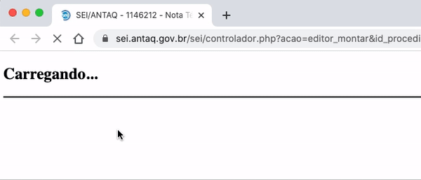

#  |  SEI Pro 

##  Alterar título da página

Com várias abas do SEI abertas, todas mostram o mesmo título — e é difícil achar a certa. O SEI Pro troca o título da aba pela **especificação e número do processo** que está aberto nela.

> 

### Como fica o título

| Página do SEI | Título da aba |
| ------------- | ------------- |
| Processo (árvore) | `Especificação do processo \| SEI - Processo 99906.713-630.000032/2025-82` |
| Editor de documento | `Editor: Tipo e número do documento - Especificação do processo \| SEI - Processo 99906.713-630.000032/2025-82` |

### Como ativar

Não há nada a fazer: o título é alterado automaticamente sempre que o SEI Pro está instalado.

### Bom saber

* Nos favoritos do navegador, a página salva também recebe esse título.
* O título é montado com os dados que o SEI Pro lê do processo. Com a opção [Desativar consultas adicionais](../pages/DESATIVACONSULTAS.md) ligada, ele permanece o do SEI.

## Próximo item

> [Endereços amigáveis em processos e documentos](../pages/URLAMIGAVEL.md)
