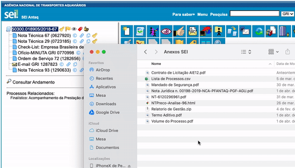
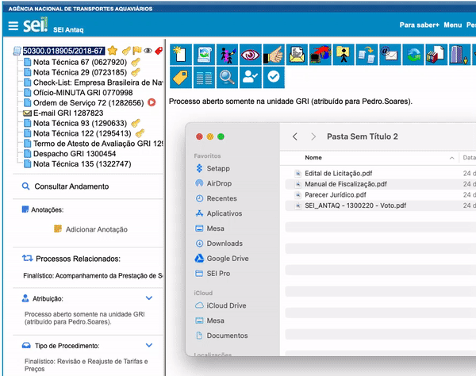

#  |  SEI Pro 

##  Enviar múltiplos documentos externos

Essa funcionalidade adiciona à árvore de processos do SEI a possibilidade de enviar múltiplos documentos externos.

>   

Arrastar um ou vários arquivos para a árvore de processos para adicioná-los automaticamente ao SEI.

Caso o nome do arquivo contenha um dos tipos de documento aceitos pelo SEI, ele será selecionado automaticamente. Caso contrário, será selecionado o tipo **Anexo**.

|  Nome do Arquivo         |  Tipo de Documento   |  Número / Nome na Árvore  |
| -----------------------  |  ------------------- |  ------------------------ | 
|  Relatório de Gestão.zip |  Relatório           |  de Gestão                |
|  Captura de Tela.png     |  Anexo               |  Captura de Tela          |

Todos os documentos são adicionados com o nível de acesso **Público** e formato **Nato-digital**. 

Caso disponível, a data de última modificação do arquivo é adicionada ao campo **Data do Documento**. Caso contrário, a data atual é adicionada.

### Ordernando documentos

É possível ordernar os documentos antes do envio ao SEI.

>  

Para isso, ative a opção **Ordernar documentos na árvore antes de enviar (Não enviar automaticamente)** nas configurações do SEI Pro.

Clique no ícone do **SEI Pro** na barra de extensões do Google Chrome:

>  

Caso o ícone não esteja visível, fixe-o na barra de extensões.

>  

Ou cole o link na barra de endereços do navegador:

> `chrome-extension://cnkocjlifhcemdapiomhehhmjmlmmgem/html/options.html`

## Próximo item

> [Menu Suspenso](../pages/MENUSUSPENSO.md)
