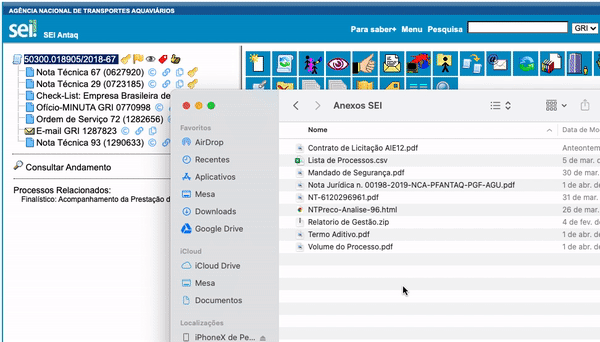
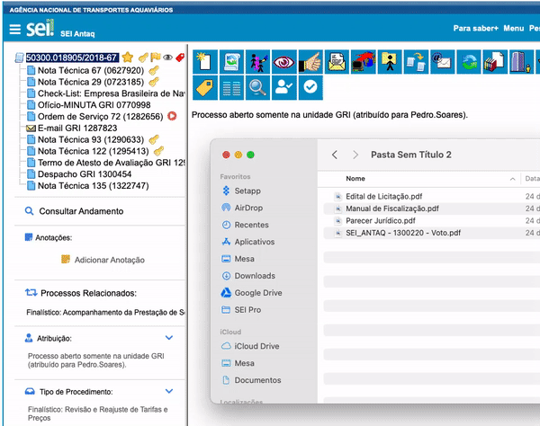

#  |  SEI Pro 

##  Enviar múltiplos documentos externos

Para juntar um PDF a um processo, o SEI pede um formulário por arquivo. Com o SEI Pro, basta **arrastar os arquivos para a árvore do processo**: eles são enviados de uma vez, com o tipo, a data e o nome já preenchidos a partir do próprio arquivo.

> 

### Como usar

1. Abra o processo;
2. **Arraste um ou vários arquivos** do computador para cima da árvore de documentos;
3. Acompanhe o envio: cada arquivo mostra uma barra de progresso e, ao final, o número SEI gerado;
4. A árvore é atualizada com os novos documentos.

### Como os campos são preenchidos

| Campo do SEI | De onde vem |
| ------------ | ----------- |
| **Tipo do documento** | Do início do nome do arquivo, quando ele coincide com um tipo aceito pelo SEI. Se não coincidir, vale o tipo padrão configurado; se não houver, **Anexo** |
| **Número / Nome na árvore** | O restante do nome do arquivo |
| **Data do documento** | A data da última modificação do arquivo; se não houver, a data de hoje |
| **Formato** | **Nato-digital**, ou o formato configurado nos valores padronizados |
| **Nível de acesso** | **Público**, ou o nível e a hipótese legal configurados nos valores padronizados |

Exemplos:

| Nome do arquivo | Tipo | Nome na árvore |
| --------------- | ---- | -------------- |
| `Relatório de Gestão.pdf` | Relatório | de Gestão |
| `Ofício 32-2026.pdf` | Ofício | 32-2026 |
| `Captura de Tela.png` | Anexo | Captura de Tela |

Os valores usados quando o arquivo não informa nada são definidos em [Valores padronizados ao criar documentos](../pages/VALDEFAULT.md).

### Conferir e ordenar antes de enviar

Por padrão, o envio começa assim que você solta os arquivos. Se preferir **revisar a lista e escolher a ordem** em que os documentos entram na árvore:

1. Nas [Configurações do SEI Pro](../pages/DESATIVARFUNCOES.md), ligue **Ordenar documentos na árvore antes de enviar (Não enviar automaticamente)** — ela aparece logo abaixo da opção desta função;
2. Solte os arquivos na árvore;
3. Arraste os itens da lista para a ordem desejada e confirme o envio.

> 

### O mesmo arquivo em vários processos

Na tela **Controle de Processos**, marque vários processos e use o botão **Enviar documentos em processos** para juntar os mesmos arquivos a todos eles — veja [Novos botões na barra de ações](../pages/BARRAACOES.md).

### Como ativar

A função vem **ligada** de fábrica. Ela fica nas [Configurações do SEI Pro](../pages/DESATIVARFUNCOES.md), aba **Geral**, seção **Árvore e Visualização de Documentos**, opção **Enviar Múltiplos Documentos Externos**.

### Bom saber

* Valem as **regras do seu órgão** para documentos externos: extensões aceitas e tamanho máximo. Um arquivo fora dessas regras é recusado com a mensagem do SEI.
* Muitos órgãos **não aceitam** arquivos do Word ou Excel (`.doc`, `.docx`, `.xls`, `.xlsx`). Converta para PDF antes.
* Precisa reduzir, dividir ou tarjar o PDF antes de juntar? Use as [Ferramentas de PDF](../pages/FERRAMENTASPDF.md).
* Acentos e caracteres especiais no nome do arquivo são simplificados no envio.

## Próximo item

> [Valores padronizados ao criar processos e documentos](../pages/VALDEFAULT.md)
