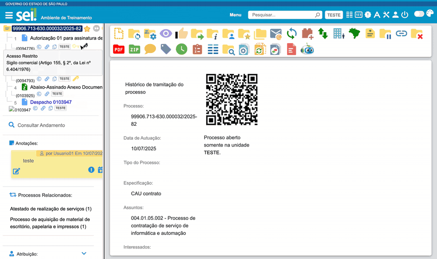

#  |  SEI Pro 

##  Destacar processos urgentes

Marque um processo como **urgente** e ele passa a aparecer **destacado** na tela Controle de Processos — com a linha em vermelho claro e um ícone de exclamação pulsando ao lado do número — para ninguém da unidade deixar passar.

> 

### Como marcar

Há dois caminhos:

**Pela árvore do processo**

1. Abra o processo;
2. No painel de informações ao lado da árvore, ao lado da especificação, clique no ícone **Adicionar/Remover Urgência**;
3. A palavra **(URGENTE)** é acrescentada ao final da especificação.

**Pelo formulário do processo**

1. Na árvore, clique em **Consultar/Alterar Processo**;
2. Ao lado do campo **Especificação**, clique no ícone de urgência;
3. Clique em **Salvar**.

Ao incluir ou alterar um **documento**, o mesmo ícone aparece ao lado do campo **Número / Nome na Árvore**, e a marca vai para o nome do documento: no campo **Número**, quando ele aparece no formulário (documentos externos e tipos em que o número é informado à mão), ou no **Nome na Árvore**, nos tipos em que o SEI esconde o número (sem numeração ou com numeração automática).

Para retirar a marca, clique de novo no ícone: o texto **(URGENTE)** é removido.

### Como funciona

A marca é o próprio texto **(URGENTE)** na especificação do processo. O SEI Pro procura esse texto na tela Controle de Processos e destaca a linha; na árvore, o número do processo também ganha o ícone. Você também pode digitar **(URGENTE)** à mão na especificação — o efeito é o mesmo.

### Como ativar

Não há opção para ligar ou desligar: o destaque funciona sempre que o SEI Pro está instalado. O ícone da árvore faz parte das [Informações adicionais na árvore do processo](../pages/INFOARVORE.md).

### Bom saber

* Como a marca fica gravada na especificação, **todos da unidade veem o texto (URGENTE)**, com ou sem o SEI Pro — mas só quem usa a extensão vê o destaque.
* A especificação também aparece na pesquisa e em outros relatórios do SEI. Retire a marca quando a urgência passar.

## Próximo item

> [Marcar processos como "Não Visualizado"](../pages/NAOLIDO.md)
