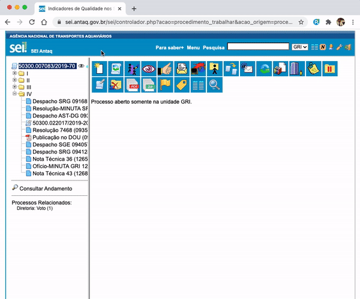

#  |  SEI Pro 

##  Valores padronizados ao criar processos e documentos

Se você preenche sempre os mesmos campos ao criar um documento — nível de acesso público, formato nato-digital, a data de hoje, a mesma observação —, deixe o SEI Pro fazer isso. Você define os valores uma vez, e **o formulário do SEI já abre preenchido**.

> 

### Onde configurar

Nas [Configurações do SEI Pro](../pages/DESATIVARFUNCOES.md), aba **Geral**, seção **Árvore e Visualização de Documentos**, ligue **Selecionar valores padronizados ao inserir um novo processo ou documento**. Logo abaixo aparecem os campos:

| Campo | O que faz |
| ----- | --------- |
| **Nome padrão do documento externo na árvore** | Texto que vai para o campo *Nome na Árvore*. No [envio de vários documentos](../pages/UPLOADDOCS.md), também é usado para escolher o **tipo** quando o nome do arquivo não indica um |
| **Observações padronizadas** | Texto do campo *Observações desta unidade* |
| **Especificações padronizadas** | Texto do campo *Descrição* (documentos) ou *Especificação* (processos) |
| **Formato do documento externo** | *Nato-digital* ou *Digitalizado nesta Unidade* (cópia autenticada administrativamente, autenticada em cartório, cópia simples ou documento original) |
| **Inserir a data de hoje no campo data do documento** | Preenche a data do documento externo |
| **Marcar nível do processo ou documento como público** | Seleciona *Público* |
| **Hipótese legal do documento** | Quando o nível não é público: escolhe *Restrito* ou *Sigiloso* com a hipótese legal indicada |
| **Ao criar novos processos, adicionar sua unidade como interessada** | Inclui a unidade atual entre os interessados |

Clique em **Salvar** e recarregue o SEI.

> **A lista de hipóteses legais vem do seu SEI.** Por isso, a caixa *Hipótese legal do documento* pode aparecer vazia na página de configurações — ela é preenchida a partir do próprio SEI. Veja o [passo a passo para definir a hipótese legal](../pages/DESATIVARFUNCOES.md#hipotese-legal).

### Onde os valores são aplicados

| Formulário | Campos preenchidos |
| ---------- | ------------------ |
| **Incluir documento** (gerado no SEI) | Nível de acesso ou hipótese legal, nome na árvore, observações, descrição |
| **Incluir documento externo** | Formato, data de hoje, nível de acesso ou hipótese legal, nome na árvore, observações, descrição |
| **Iniciar processo** | Nível de acesso ou hipótese legal, observações, especificação, unidade como interessada |

### Bom saber

* Os campos continuam **editáveis**: os valores são só um ponto de partida, e você pode trocá-los antes de salvar.
* Campos em branco nas configurações não alteram nada no formulário.

## Próximo item

> [Alertar sobre documentos não assinados ao enviar um processo](../pages/DOCSNAOASSINADOS.md)
